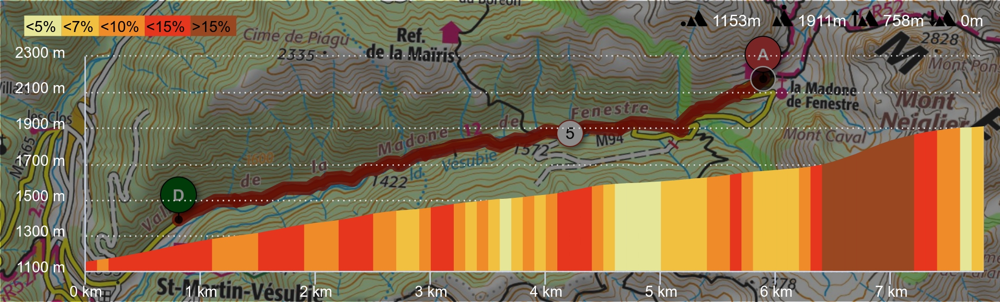
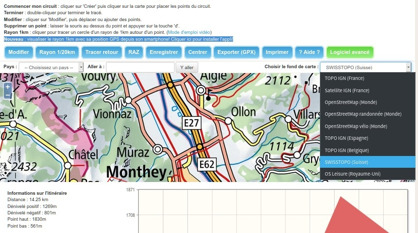

# Web route creation

* Create pedestrian itinerary along existing routes:
  * [Google My Maps](https://www.google.com/maps/d/)
  * [OpenRunner](https://www.openrunner.com) (custom/IGN/OpenCycleMap)

* Draw manual itinerary, display distance/elevation, export as GPX with elevation, and share:

  * [AllTrails](https://www.alltrails.com/explore/map/new) (ex-gpsies) (OSM-based only)
  * [OpenRunner](https://www.openrunner.com) (custom/IGN/OpenCycleMap)
   
  * [Visorando](https://www.visorando.com/logiciel-randonnee.html)
   

No current web software allows to add IGN-based altitude.

# Web GPX edition

Use-case: Edit a track recording from MyTrails, Oruxmaps etc.

Split, merge, delete one/many points... [TODO compare them](https://docs.google.com/spreadsheets/d/1ZBKFTQTMZijVf49vbS7oeUfpVRwpN4ZVADwb5oHcVzI/)

* [opentraveller](https://opentraveller.net/) ([fb](https://www.facebook.com/opentraveller01))
* [gpx.studio](https://gpx.studio/)
* [opoto wtracks](https://opoto.github.io/wtracks/)
  * open-source
* [mygpsfiles](http://www.mygpsfiles.com/app/)
  * maps: OSM/OTM/IGN
  * display altitude/speed/hr vs distance/time
  * split/merge/clean/elevate/...
 
it would be possible to have better gpx selection using dropbox api, or on the local filesystem with eg js-fileexplorer and the [file system APIs](https://cloudfour.com/thinks/the-many-confusing-file-system-apis/) (gg chrome only)

Examples using FileSystemDirectoryReader:
[react-dropzone](https://github.com/react-dropzone/file-selector?tab=readme-ov-file#browser-support) ; crust-io/crust-files

# Desktop GPX edition

* [GPXSee](https://www.gpxsee.org/)

# Applis Smartphones

[Comparatif : 5 applications GPS pour randonner](https://www.i-trekkings.net/articles-outdoor/comparatif-5-applications-gps/)

Bon article, qui teste **iPhiGéNie / ViewRanger / AlpineQuest / OruxMaps / OsmAnd**. Il manque notablement **MyTrails, Visorando, LocusMaps** ;
mais sans détails sur le support de cartes additionnelles "custom", notablement meilleur sur MyTrails, LocusMaps, et OruxMaps, ni sur les formats supportés (nombreux sur Orux et Locus, MGM seulement sur MyTrails)

## Offline Map support:

| **Map**                       | Orux | Alpine | Locus | MOBAC | GDAL  |
| -------                       |:----:|:------:|:-----:|:-----:|:-----:|
| 		__*Raster formats*__
| `.mbtiles` raster             |  ✓   |   ✓    |   ✓   |   ✓   |  RW  |
| `.rmap` CompeGPS              |  ✓   |   ✓    |   ✓   |   ✓   |  ✕   |
| OruxMaps `.otrk2.xml+sqlite`  |  ✓   |   ✕    |   ✓   |   ✓   |  ✕   |
| OziExplorer `.map+ozf2`       |  ✓   |   ✓    |   TAR |PNG+Map|  R   |
| OziExplorer `.ozxf3`          |  ✕   |   ✓    |   ✕   |   ✕   |  R   |
| AlpineQuest old `.aqm`        |  ✕   |   ✓    |   ✕   |   ✓   |  ✕   |
| AlpineQuest new `.pgd`        |  ✕   |   ✓    |   ✕   |   ✕   |  ✕   |
| OSM `XYZ` `zip`               |      |   ✓     |       |   ✓   |  ✕   |
| GEMF `.gemf`                  |  ✕   |   ✕    |   ✓   |   ✕   |  ✕   |
| BackcountryNavigator `.sqlite`|  ✕   |   ✕    |   ✓   |   ✓   |  ✕   |
| MemoryMap `.qct`              |  ✕   |   ✓    |   ✕   |   ✕   |  ✕   |
| 		__*Vector formats*__
| `.map` OSM MapsForge vector   |  ✓   |   ✕    |   ✓   |   -   |  ✕   |
| `.img` Garmin vector          |  ✓   |   ✕    |   ✓   |   -   |  ✕   |
| `.mbtiles` vector             |  ✓?  |   ✕    |   ✓?  |   -   |  RW  |
| `.shp` ShapeFile              |  ✕   |   ✓    |   ✕   |   -   |  RW  |
| 		__*DEM formats*__
| SRTM-DTED `.hgt`              |  ✓   |   ✓    |   ✕   |   -   |  RW  |
| `.hdr+dem` GTOPO30...         |  ✓   |   ✕    |       |   -   |  RW  |
||||

*Legend: R is read ; RW is read-write*

Notes:
* MyTrails supports only MGMaps format (either `.sqlite` or *img folder* variants, so it's not included in the table)
* HGT supports only 1-arc-second and 3-arc-second resolutions at least in AlpineQuest

More details:

* [AlpineQuest file-based maps](https://www.alpinequest.net/en/help/v2/maps/file-based-select)
* [LocusMaps external maps](https://docs.locusmap.eu/doku.php?id=manual:user_guide:maps_external)

---

Also, Orux and supports composite maps, very useful to ad a slope overlay to any map. AlpineQuest  supports it through "Add Overlay" and "Favourites", and handles missing zoom levels better.

Orux  and AlpineQuest can use DEM elevation models to query altitude of a point and calibrate GPS.
AlpineQuest

##
