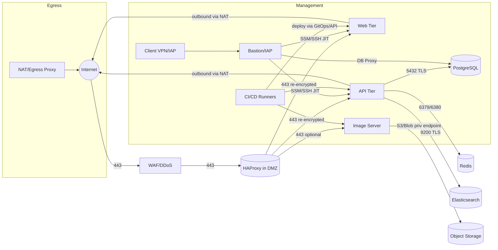
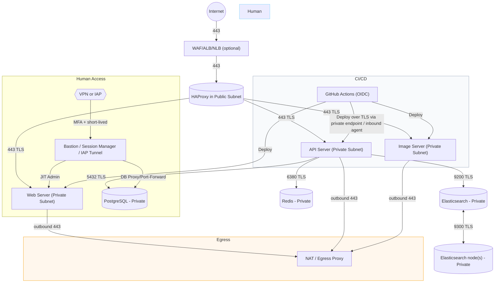

# Cloud Network Security Architecture

> explain to a senior software architect the blueprint of a modern cloud network security architecture : private networks, VPNs, DMZ...
> I have an HA proxy, a server for human access continuous deployment, a web server, an API server, an image server, DBs (PGSQL, Redis, Elastic).
> explain how I would structure and segment the networks and with what benefits. use diagrams.

> take a step back and give me the motivations from the security / threat assessment angle.
> which attack scenario are addressed by these, and, for a relatively small project, where I could go simpler.
> I think the main thing I want to address is to limit the attack surface (and especially making sure only my CD on github action and a few privileged users have access to the backends) but I'm not an expert


It assumes a VPC/VNet‑style environment with multiple AZs/zones, and emphasizes **network segmentation, least privilege, layered controls, and zero‑trust principles**. I’ll place your components (HAProxy, human access / CI‑CD server, web, API, image server, Postgres, Redis, Elasticsearch) and show how to wire them with minimal blast radius and clear trust boundaries.

***

## 1) Goals & Design Tenets

*   **Segment by function and sensitivity** (public/DMZ, app, data, management, shared services, egress).
*   **Default‑deny** everywhere; only open the minimal ports between precise principals.
*   **TLS everywhere** (north‑south and east‑west) + mTLS for service‑to‑service where possible.
*   **Identity‑centric access**: SSO + MFA, just‑in‑time (JIT) privileges, no standing keys.
*   **High availability** across zones, **observability + egress control** for forensics and compliance.
*   **Automate as policy‑as‑code** ( IaC + controls as code ).

***

## 2) High‑Level Topology (Hub‑and‑Spoke)

**Hub (Shared / Security / Transit VPC|VNet):**

*   NGFW + IDS/IPS (optional), **WAF** (in front of HAProxy), **central DNS**, **egress/NAT**, **Client VPN** and/or **Identity‑Aware Proxy (IAP)**, **bastion** (if you still keep SSH), **logging/SIEM**.

**Spokes (Workload VPCs|VNets):**

*   **DMZ/Public Subnets** (only load‑balancing and termination points).
*   **App Private Subnets** (web, API, image servers).
*   **Data Private Subnets** (Postgres, Redis, Elasticsearch).
*   **Management Subnet** (CI/CD runners, config mgmt, backup agents; optionally in Hub).
*   **Observability Subnet** (Prometheus, Loki/ELK data nodes may live here or in Hub).

Traffic between spokes transits the Hub so you can **inspect, log, and control east‑west** flows.

***

## 3) Placement of Your Components

*   **Internet → WAF → HAProxy (DMZ/Public)**
    *   HAProxy can terminate TLS and optionally re‑encrypt to app tier.
    *   Consider managed DDoS/WAF before HAProxy; keep HAProxy stateless and easy to scale.

*   **App Tier (Private)**
    *   **Web server** (if not fully front‑ended by HAProxy).
    *   **API server** (separate subnet or SG from Web).
    *   **Image server** (separate SG; controls who can fetch/put images).

*   **Data Tier (Private, no direct Internet)**
    *   **PostgreSQL** (5432), **Redis** (6379 or 6380 TLS), **Elasticsearch** (9200 REST, 9300 intra‑cluster).
    *   Each in **separate subnets** (or at least distinct security groups) with **no inbound** except from specific app SGs.

*   **Management / Human Access**
    *   **Bastion / IAP** (client VPN/IAP → privileged access to private subnets).
    *   **CI/CD server** (GitLab Runner/Jenkins agents, ArgoCD, etc.). Lives in **Management subnet**, never in DMZ.
    *   Use short‑lived credentials (OIDC federation for cloud + GitOps pull).

*   **Shared Services**
    *   Centralized **logging/metrics** (e.g., Elastic/Opensearch for logs, Prometheus for metrics), **secrets manager**, **PKI/cert mgmt**, **artifact registry** mirror.

***

## 4) Subnets and Segmentation

Each VPC/VNet spans ≥2 AZs; each **tier** has **one subnet per AZ**:

*   **DMZ/Public**: `dmz-a`, `dmz-b`
    *   Ingress LB/WAF and HAProxy nodes (if not using managed LB).
    *   Only inbound 443/80 from Internet, outbound to App Tier on allowed ports.

*   **App Private**: `app-a`, `app-b`
    *   Web, API, Image servers. No Internet gateway; egress only via NAT/egress proxy.

*   **Data Private**: `data-a`, `data-b`
    *   PGSQL, Redis, Elasticsearch. No inbound from DMZ; only from App or Mgmt (backup/ops).

*   **Management**: `mgmt-a`, `mgmt-b`
    *   Bastion/IAP, CI/CD, config management, backup. Access limited to VPN/IAP identities.

*   **Shared/Egress**: `egress-a`, `egress-b`
    *   NAT/egress proxy, URL filtering, package mirrors to reduce Internet needs.

*   **(Optional) Transit**: for hub‑and‑spoke routing and inspection.

**Controls per layer**

*   **Route tables** ensure DMZ cannot route directly to Data subnets.
*   **NACLs** (stateless) for coarse subnet‑level deny (e.g., deny DMZ→Data).
*   **Security Groups/NSGs** (stateful) for fine‑grained allow between exact SGs.

***

## 5) Traffic Flows (North–South and East–West)



***

## 6) Security Group (NSG) Matrix (Allow Rules Only)

| Source SG            | Destination SG         | Ports/Proto             | Rationale                                  |
| -------------------- | ---------------------- | ----------------------- | ------------------------------------------ |
| `internet`           | `dmz-haproxy`          | 443/tcp (80 if needed)  | Public HTTPS to HAProxy/WAF only           |
| `dmz-haproxy`        | `app-web`              | 443/tcp                 | HAProxy → Web (TLS)                        |
| `dmz-haproxy`        | `app-api`              | 443/tcp                 | HAProxy → API (TLS)                        |
| `dmz-haproxy`        | `app-image` (optional) | 443/tcp                 | Only if image server serves public content |
| `app-api`            | `data-postgres`        | 5432/tcp (TLS)          | API → DB                                   |
| `app-api`            | `data-redis`           | 6379/6380 tcp           | API → Redis (prefer TLS @6380)             |
| `app-api`            | `data-elasticsearch`   | 9200/tcp (TLS)          | API → ES REST                              |
| `data-elasticsearch` | `data-elasticsearch`   | 9300/tcp (TLS)          | ES cluster internal                        |
| `mgmt-bastion`       | `app-*`,`data-*`       | SSM agent/SSH, DB proxy | JIT admin access only                      |
| `mgmt-cicd`          | `app-*`                | 22/443 or agent ports   | Deployments (prefer pull/GitOps)           |
| `app-*`,`data-*`     | `egress-nat`           | Any → 80/443 outbound\* | Controlled egress via proxy/NAT            |

\* Tighten to allowlists: OS repos, container registry, time/NTP, CA/CRL endpoints, etc.

**NACL examples (stateless, subnet scope)**

*   Deny `dmz` → `data` all.
*   Allow `dmz` → `app` 443.
*   Allow `app` → `data` on 5432/6379/9200 (and deny all else).
*   Deny all inbound to `data` from `internet`.

***

## 7) VPN/Access Patterns (Zero‑Trust‑friendly)

*   Prefer **Client VPN or IAP** with **SSO+MFA**, device posture checks, and **JIT** elevation.
*   Avoid direct SSH from laptops: use **SSM/Session Manager** or an **IAP tunnel** to target instances/containers with full audit.
*   **Site‑to‑Site VPN/Private Link/ExpressRoute/Direct Connect** for corp or on‑prem networks.
*   Expose **no data tier to the Internet**. For DB access, use a **DB proxy** (TLS, IAM auth) or **port‑forward via IAP**.


***

## 7b) Human Access: VPN vs Identity‑Aware Proxy (IAP)

Both solve “let a few privileged users in, safely.” The right choice depends on **how much infra you want to run**, **auditability**, and **developer UX**.

### What they are (in practice)

*   **VPN (Client VPN or IPSec)**
    *   A network tunnel into your private subnets. Once connected, the laptop has an IP “inside” and can reach allowed hosts/ports (usually constrained by firewall rules).
*   **Identity‑Aware Proxy (IAP) / Zero‑Trust Access**
    *   An application‑layer tunnel that **authenticates each request/connection** against identity (SSO/MFA, device posture), and **brokers** access to specific services/ports—often without granting broad network reachability.

### Key trade‑offs

**Security & Least Privilege**

*   **VPN**
    *   ✅ Mature, simple concept; can be locked down with split‑tunnel + ACLs.
    *   ⚠️ Risk of **“too much network” exposure** if rules are loose; lateral movement requires careful per‑subnet/SG controls.
    *   ⚠️ Device posture checks vary; needs extra tooling.
*   **IAP**
    *   ✅ **Per‑app/port allow** based on identity; **narrow blast radius** and strong MFA posture.
    *   ✅ Audits per session; easier to enforce **JIT access** and session recording.
    *   ⚠️ May require running an **IAP gateway/connector** and adjusting workflows (e.g., DB via IAP port‑forward instead of direct).

**Operational Overhead**

*   **VPN**
    *   ✅ Easy mental model; many managed options.
    *   ⚠️ You manage routing, ACLs, client configs, certs; can become “snowflake” if not automated.
*   **IAP**
    *   ✅ Centralized policy per resource; scales cleanly with identity groups.
    *   ⚠️ Initial setup and tooling (connectors/agents) if not using a managed offering.

**Developer Experience**

*   **VPN**
    *   ✅ Familiar: “connect and use tools as usual.”
    *   ⚠️ Might be blocked by local firewalls/captive portals; can be flaky on corporate networks.
*   **IAP**
    *   ✅ Simple for web apps and SSH/DB via IAP plugins/tunnels; great for **just‑in‑time** flows.
    *   ⚠️ Some CLI/db tools need a small adaptation (use IAP proxy command or a sidecar).

**Observability & Compliance**

*   **VPN**
    *   ✅ You can log connections, but **per‑application visibility** isn’t built‑in.
    *   ⚠️ Session‑level auditing often requires extra components.
*   **IAP**
    *   ✅ **Per‑resource audit trails** (who accessed which service, when, from which device).
    *   ✅ Easier to enforce **approval flows** and time‑boxed access.

**Cost / Simplicity (small project)**

*   **VPN**
    *   ✅ Cheap, quick to stand up.
    *   ⚠️ Needs discipline to keep rules tight; otherwise undermines your “limit surface” goal.
*   **IAP**
    *   ✅ Security aligned with your **stated goal** (few humans, narrow access).
    *   ⚠️ Slightly higher initial setup cost/time than a basic VPN.

### Quick decision guide

*   Choose **VPN** if:
    *   You need **full network** access temporarily (e.g., migrations), want the fastest path, and are confident you’ll **lock down ACLs** and **disable public SSH**.
*   Choose **IAP** if:
    *   Your priority is **minimum necessary access** for a **small set of users**, with **strong MFA**, **auditability**, and less risk of over‑permissive network paths. This matches your stated goal best.

> **Pragmatic hybrid**: Use IAP/IAM‑based access for day‑to‑day (SSH/DB/proxies), keep a **VPN as break‑glass** path for incidents—with strict logging, MFA, and time‑boxed credentials.


***

## 8) TLS, Identity, and Secrets

*   **TLS 1.2+** everywhere; **mTLS** between HAProxy↔App and App↔Data where viable.
*   Certificates via central ACM/Cert‑Manager; automate rotation.
*   **Service identity**: SPIFFE/SPIRE or cloud IAM service identities; **OIDC federation** for CI/CD.
*   **Secrets manager** (rotate DB creds, Redis passwords, ES API keys).
*   Disable plaintext Redis; use `requirepass`, TLS, auth tokens; bind only to private IPs.

***

## 9) Egress Control & Supply Chain

*   Force outbound HTTP/HTTPS through **egress proxy** with URL/domain allowlists.
*   Mirror critical artifacts (language/package repos, container base images) into **private registry**; lock builds to those.
*   DNS: use **private zones** for internal services; block outbound 53 except resolvers.

***

## 10) High Availability & Resilience

*   **Multi‑AZ** subnets for each tier; spread nodes.
*   HAProxy:
    *   Option A: Fronted by managed LB/WAF; run HAProxy as stateless pool in DMZ.
    *   Option B: Pair with VRRP/keepalived and anycast/floating IP within each AZ; still place WAF before it.
*   **Datastores**:
    *   PG: managed or self‑managed HA (primary/replicas + automatic failover), PITR backups, replicas per AZ.
    *   Redis: cluster/sentinel or managed.
    *   ES: 3+ master‑eligible nodes across AZs; snapshots to object storage, index lifecycle mgmt.
*   **Backups**: Air‑gapped bucket, immutability (object lock), tested restores.

***

## 11) Observability & Detection

*   Flow logs at VPC/VNet/subnet level; ship to SIEM.
*   Centralized logs (app, HAProxy, DB, OS), metrics, traces (OTel).
*   IDS/IPS mirror off transit/egress; anomaly alerts on egress spikes and auth failures.
*   Synthetic probes from outside (health + TLS expiry).
*   Security posture scanning (CIS benchmarks, SG drift).

***

## 12) Example Logical Diagram (ASCII)

                               +----------------- Cloud Edge -----------------+
    Internet --- DDoS --- WAF/ALB --- DMZ/Public Subnets (AZ-A/B) ---+-------+
                                         |                           |
                                      HAProxy pool                (no state)
                                         |
                             +-----------+------------+
                             |                        |
                    App Private (AZ-A/B)        App Private (AZ-A/B)
                   [ Web SG ]   [ API SG ]     [ Image SG ]
                         |           |                |
                         |           +------\         |
                         |                  \        |
                         |                   \       |
                         v                    v      v
                     Data Private (AZ-A/B): [Postgres SG][Redis SG][Elastic SG]
                         ^             ^          ^              ^
                         |             |          |              |
            Mgmt Subnet: Bastion/IAP---+----CI/CD runners--------+
                     \__ SSO/MFA VPN (Client VPN / IAP) ___/
     
    Egress/NAT Subnets -> NAT/Proxy -> Limited Internet (repos, registries, CRLs)
    Central DNS, PKI, Secrets, SIEM, Metrics/Logs live in Hub/Shared Services

***

## 13) HAProxy & Path Termination Choices

*   **TLS termination at WAF/LB**, re‑encrypt to HAProxy, then re‑encrypt to App (recommended: uniform TLS with SNI and per‑service certs).
*   HAProxy performs **rate‑limiting, header normalization, bot rules, mTLS to backends**, circuit breaking, blue/green routing.
*   Keep **no app/data ports open in DMZ**; **only 443** in from Internet.

***

## 14) Concrete Rules/Ports for Your Stack

*   **HAProxy ↔ Web/API/Image**: `443/tcp` (backend TLS, client cert or OAuth2 token validation if feasible).
*   **API ↔ PostgreSQL**: `5432/tcp` (TLS, SCRAM auth or IAM auth).
*   **API ↔ Redis**: `6380/tcp` (TLS+auth; if 6379 ensure VPC‑internal only).
*   **API ↔ Elasticsearch**: `9200/tcp` (TLS; block `_cat` unauthenticated; RBAC on indices).
*   **Elasticsearch cluster**: `9300/tcp` (TLS intra‑cluster only among ES nodes).
*   **Mgmt**:
    *   Bastion/IAP → Instances: Session Manager/agent channel (no SSH keys at rest); or `22/tcp` JIT from bastion only.
    *   CI/CD → App: 443 to deployment endpoints/agents; prefer **pull‑based GitOps** to avoid broad egress from CI.

***

## 15) Data Plane Alternatives (Kubernetes / Service Mesh)

If you containerize:

*   Put **ingress controller (HAProxy/NGINX)** in **DMZ with NLB/ALB** ahead.
*   **Network policies** (Calico/Cilium) replicate SG‑like segmentation inside the cluster.
*   **mTLS** and **intent‑based allow** with a **service mesh** (Istio/Linkerd) for API↔DB proxies, retries, and policy.
*   Still keep **data tier outside cluster** or as separate node pools with stricter policies.

***

## 16) Step‑by‑Step Rollout Plan

1.  **Create Hub**: shared services VPC/VNet (WAF, VPN/IAP, NAT, DNS, logging, SIEM).
2.  **Create App Spoke**: DMZ, App, Data, Mgmt subnets per AZ with route tables.
3.  **Attach routing** via Transit/Peering; enforce **east‑west through Hub**.
4.  **Implement NACLs (coarse)** and **Security Groups (fine)** default‑deny; add allow rules from the matrix.
5.  **Stand up HAProxy behind WAF** in DMZ; test 443 ingress only.
6.  **Deploy Web/API/Image** in App subnets; enable TLS/mTLS.
7.  **Provision Data** with TLS, auth, RBAC; block all non‑required ports.
8.  **Enable VPN/IAP** with SSO+MFA; switch ops to SSM/IAP; remove public SSH.
9.  **Egress proxy** + allowlists; lock CI/CD and nodes to internal mirrors/registries.
10. **Observability**: flow logs, central logs/metrics/traces; alerting.
11. **Resilience**: multi‑AZ redundancy tests, backup/restore drills, game days.
12. **Codify** everything in Terraform/Bicep/ARM/CloudFormation; add guardrails (OPA/Conftest).

***

## 17) Benefits by Segment

*   **DMZ/Public**: Contains blast radius; only layer‑7 proxy exposed; simplifies patch cadence.
*   **App Private**: Isolates business logic; clear east‑west policy; safer blue/green deploys.
*   **Data Private**: No direct Internet; least‑privilege only from app SGs; audit‑friendly.
*   **Management**: Strongly gated human access (SSO/MFA/JIT); separates CI/CD trust boundary.
*   **Shared/Egress**: Central control and visibility over outbound; reduces supply chain risk.
*   **Hub/Transit**: East‑west inspection; consistent controls and DNS/PKI across spokes.

***

## 18) Optional: Minimal Terraform‑style SG Example (illustrative)

```hcl
# Allow HAProxy to talk to API over TLS
resource "aws_security_group_rule" "haproxy_to_api" {
  type                     = "ingress"
  from_port                = 443
  to_port                  = 443
  protocol                 = "tcp"
  source_security_group_id = aws_security_group.dmz_haproxy.id
  security_group_id        = aws_security_group.app_api.id
}
# API to Postgres
resource "aws_security_group_rule" "api_to_pg" {
  type                     = "ingress"
  from_port                = 5432
  to_port                  = 5432
  protocol                 = "tcp"
  source_security_group_id = aws_security_group.app_api.id
  security_group_id        = aws_security_group.data_pg.id
}
```

*(Adapt NSG/Firewall resources for Azure/GCP similarly.)*

***

## Motivations & Threat Scenarios

1.  **Attack Surface Reduction**
    *   **Threat:** Publicly exposed services (API, DB, Redis, Elasticsearch) can be scanned and exploited.
    *   **Control:** Put only HAProxy (or a managed LB/WAF) in the public subnet; everything else in private subnets with no direct Internet access.
    *   **Benefit:** Even if HAProxy is compromised, attacker still needs to pivot through multiple layers.

2.  **Credential Theft / Unauthorized Access**
    *   **Threat:** Stolen SSH keys or leaked DB passwords → full backend compromise.
    *   **Control:** Use VPN/IAP + MFA for humans; short-lived tokens for CI/CD; secrets manager for DB creds.
    *   **Benefit:** No standing credentials; attackers can’t just “log in” if they steal a key.

3.  **Supply Chain / CI/CD Abuse**
    *   **Threat:** If your GitHub Actions runner or pipeline is hijacked, attacker can deploy malicious code.
    *   **Control:** Restrict CI/CD to deploy only via secure channel (VPN or private endpoint), and enforce signed artifacts.
    *   **Benefit:** Even if GitHub is compromised, attacker can’t reach DB directly.

4.  **Lateral Movement**
    *   **Threat:** Once inside one server, attacker moves to DB or other sensitive nodes.
    *   **Control:** Security groups and subnet isolation (App → DB only on specific ports).
    *   **Benefit:** Compromise of web server doesn’t automatically mean DB breach.

5.  **Data Exfiltration**
    *   **Threat:** Malware on app server sends data out.
    *   **Control:** Egress proxy/NAT with allowlists; block direct Internet from DB tier.
    *   **Benefit:** Harder for attacker to exfiltrate without triggering alerts.

***

## Where You Can Go Simpler (Small Project)

If your main goal is **limit attack surface and ensure only GitHub Actions + a few humans can access backends**, you can **skip the full hub-and-spoke complexity** and do:

*   **One VPC with 3 subnets:**
    *   **Public:** HAProxy (or managed LB/WAF).
    *   **Private-App:** Web/API/Image servers.
    *   **Private-Data:** DBs (Postgres, Redis, Elasticsearch).
*   **Security Groups:**
    *   Public → HAProxy: 443 only.
    *   HAProxy → App: 443 only.
    *   App → DB: 5432/6379/9200 only.
*   **VPN or Identity-Aware Proxy for humans** (no public SSH).
*   **GitHub Actions:** Use OIDC federation or deploy via a private endpoint (no open SSH from GitHub).
*   **TLS everywhere** (HAProxy ↔ App ↔ DB).
*   **Secrets in a manager** (not hardcoded).
*   **Optional:** NAT gateway for outbound updates; block DB outbound Internet.

This gives you **90% of the security benefit with 30% of the complexity**.


### **Attack Scenarios Addressed by This Simpler Setup**

*   **Port scanning / exploit attempts:** Only HAProxy exposed.
*   **Direct DB attacks:** DB in private subnet, SG denies all except App SG.
*   **Credential theft:** VPN + MFA for humans, OIDC for CI/CD.
*   **CI/CD compromise:** No direct DB access from GitHub; only deploy to App tier.
*   **Lateral movement:** SG rules limit east-west traffic.

### Network Diagram

This keeps your **attack surface minimal** and makes sure **only GitHub Actions and a few privileged users** can touch the backends.




### Physical segmentation (one VPC/VNet, three subnets across 2 AZs)

    VPC/VNet
    ├─ Public Subnets (AZ-a/b)
    │   └─ HAProxy (+ optionally managed WAF/ALB in front)
    ├─ Private-App Subnets (AZ-a/b)
    │   ├─ Web
    │   ├─ API
    │   └─ Image server
    └─ Private-Data Subnets (AZ-a/b)
        ├─ PostgreSQL
        ├─ Redis (TLS/auth only)
        └─ Elasticsearch (9200/9300 TLS)
    (+ Optional small Mgmt “corner” for bastion/IAP gateway; can be part of App private)

### Minimal security group policy (default‑deny; **allow only**)

*   **Internet → HAProxy (Public):** `tcp/443` (and `80` only for redirect).
*   **HAProxy → App tier:** `tcp/443` to `Web`, `API`, `IMG`.
*   **App → DBs:**
    *   API → Postgres `tcp/5432` (TLS, SCRAM/IAM)
    *   API → Redis `tcp/6380` (TLS + auth)
    *   API → Elasticsearch `tcp/9200` (TLS, RBAC)
    *   ES inter‑node: ES ↔ ES `tcp/9300` (TLS, node certs)
*   **Human access (VPN/IAP/Bastion) → targets:**
    *   JIT/approved IPs only; ideally **SSM/Session Manager** or **IAP tunnel** instead of SSH.
    *   For DB admin: via **DB proxy/port‑forward**; no public DB exposure.
*   **Egress:** App can go **outbound 443 only via NAT/proxy** (OS updates, registries).
    *   Data tier: **no Internet egress** unless strictly needed (backups via VPC endpoint).

This gives you **tight blast‑radius control** without full hub‑and‑spoke complexity.

***
  
## 3) Minimal “Getting Started” Checklist (aligned to your goals)

*   **Public exposure:** Only `443/tcp` to HAProxy (behind a managed WAF if available).
*   **Backend isolation:** Web/API/IMG in private app subnets; DBs in private data subnets.
*   **SG rules:**
    *   `internet → haproxy:443`
    *   `haproxy → app:443`
    *   `api → postgres:5432`, `api → redis:6380`, `api → es:9200`, `es ↔ es:9300`
*   **Human access:** Prefer **IAP** or **SSM Session Manager**; if VPN, enforce per‑host ACLs + MFA, and disable public SSH.
*   **CI/CD (GitHub Actions):**
    *   Use **OIDC federation** to get short‑lived credentials.
    *   **Deploy into app tier** only (pull‑based agents or private endpoints).
    *   No CI direct path to DBs.
*   **TLS & Secrets:** TLS everywhere; store credentials in a secrets manager; enable DB auth rotation.
*   **Egress:** Outbound via NAT/proxy; allowlist registries and OS repos. Deny Internet egress from DBs.

***

## 4) Optional: Even Simpler (if you want to reduce moving parts further)

*   Use a **managed WAF/LB** to front **HAProxy** or replace it with a **managed reverse proxy**.
*   Skip a dedicated management subnet—run **IAP/SSM** so you don’t need any SSH bastion at all.
*   For Elasticsearch, consider a **managed service** to avoid exposing/administering 9200/9300.
*   If the image server is essentially object storage, replace it with **bucket + private endpoint**.

***
